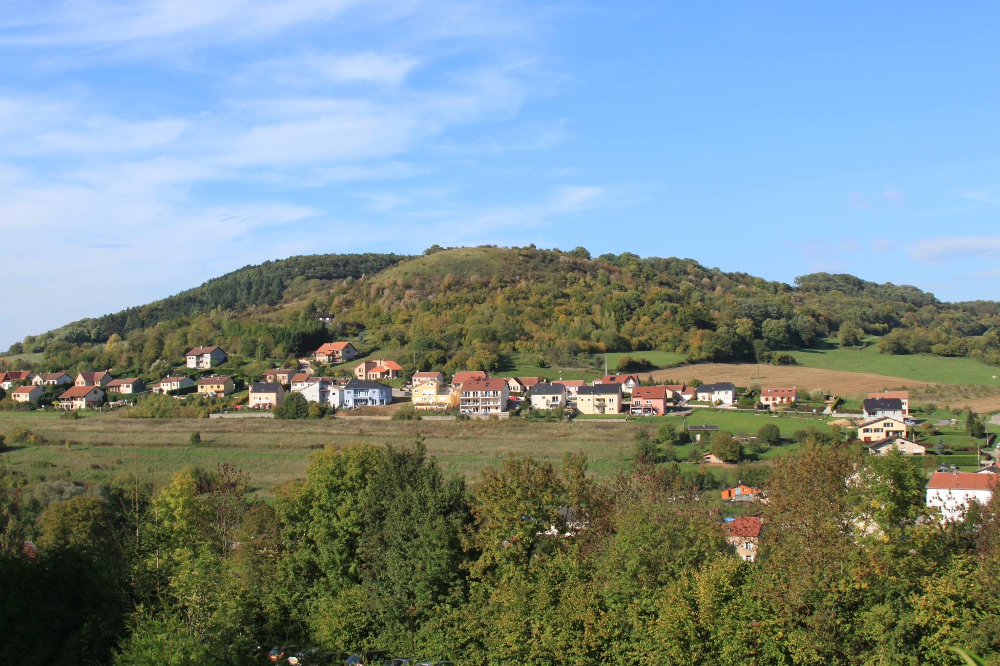
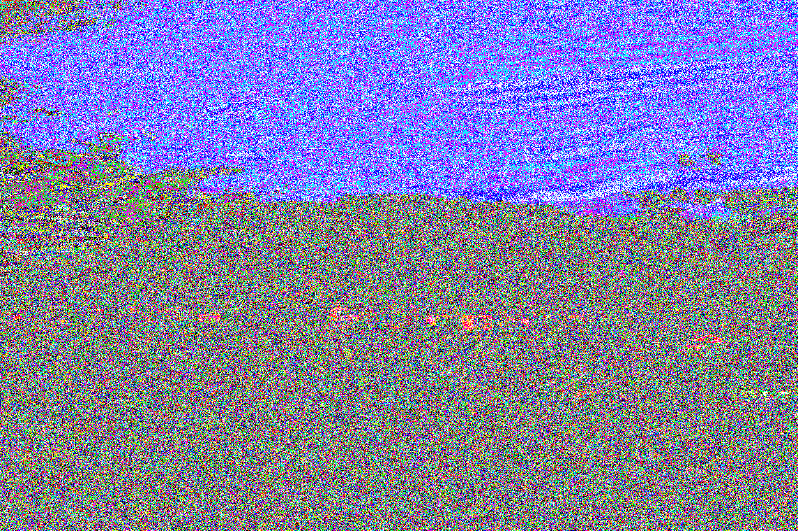

Simple method
-------------

Considérerons un pixel comme le triplet: (Red, Blue, Green). Une composante peut varier
entre 0 et 255, par exemple (127, 224, 148).

Une technique connue de stéganalyse que nous allons utiliser, consiste tout simplement
à remplacer les composantes pairs des pixels par 0 et les composantes impairs par 255.
Il s'agit de la stéganalyse par parité.
Par exemple le pixel (132, 247, 123) va devenir (0, 255, 255).
Pour illustrer cela, voici une image (sans texte caché) ainsi que l'image résultante d'une stéganalyse par parité.

Une technique connue de stéganalyse que nous allons utiliser, consiste tout simplement
à remplacer les composantes pairs des pixels par 0 et les composantes impairs par 255.
Il s'agit de la stéganalyse par parité. Par exemple le pixel (132, 247, 123)
va devenir (0, 255, 255).

Pour illustrer cela, voici une image (sans texte caché) ainsi que l'image résultante
d'une stéganalyse par parité.

            

Commande à exécuter avec Stéganô pour obtenir une stéganalyse par parité: 

.. code-block:: python

    import urllib
    from PIL import Image
    
    def decode_image(img):
        width, height = img.size
        msg = ""
        index = 0
        for row in range(height):
            for col in range(width):
                r, g, b = img.getpixel((col, row))
                if row == 0 and col == 0:
                    msg_length = r
                elif index <= msg_length:
                    msg += chr(r)
                index += 1
        return msg

        urllib.urlretrieve("http://cedric.bonhomme.free.fr/images/Lenna_Simple_Method.png", "Lenna.png")
        img = Image.open("Lenna.png")
        print decode_image(img)
